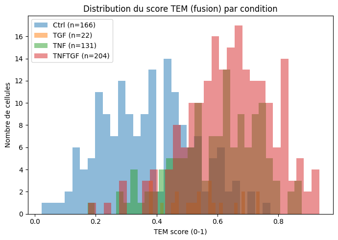
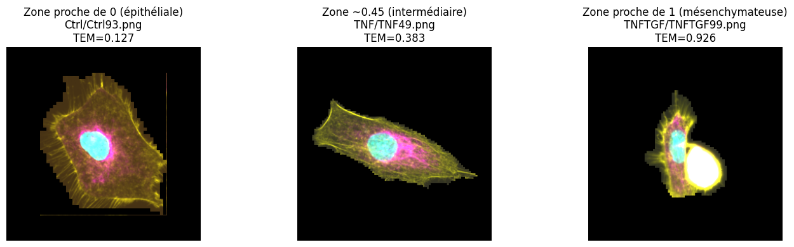
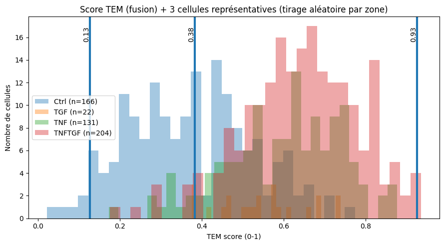
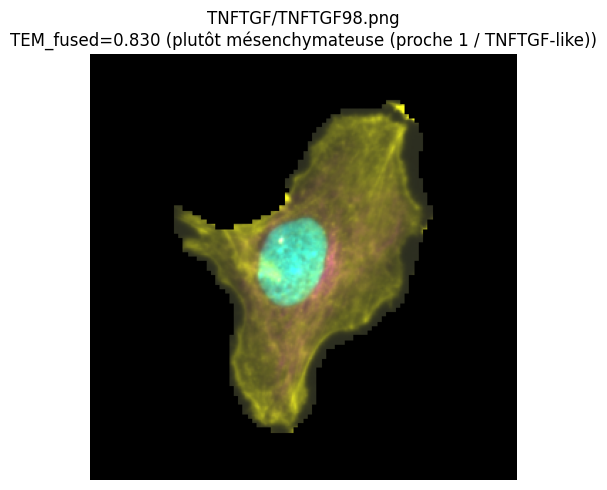
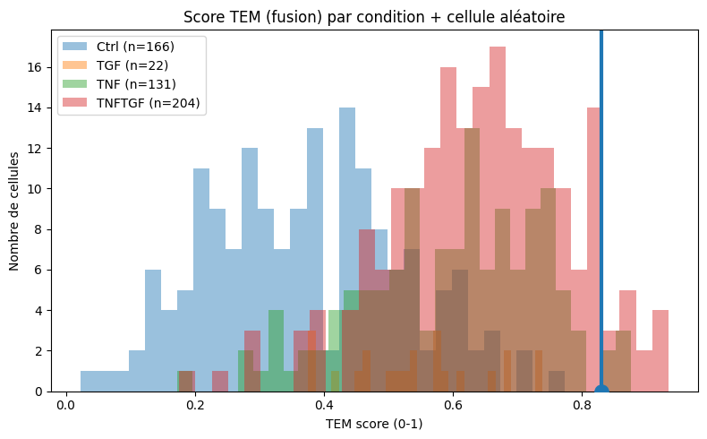

# CellMorphoTEM: Quantifying Epithelial-to-Mesenchymal Transition from Cell Morphology Using Transfer Learning

---

## 1. Introduction

Epithelial-to-Mesenchymal Transition is a fundamental biological process in which cells progressively lose their epithelial identity and acquire mesenchymal properties — a key mechanism in cancer metastasis, wound healing, and tissue remodeling. Quantifying where a cell sits on this spectrum traditionally requires molecular assays (gene expression profiling, protein markers), which are time-consuming and not directly tied to morphology.

Cell morphology, however, changes substantially during EMT: epithelial cells are compact and tightly packed, while mesenchymal cells are elongated, spread, and show prominent actin stress fibers. This motivates an image-based scoring approach.

The goal of this project is to **automatically score EMT from microscopy images alone**, producing a continuous TEM score per cell without any labeled training data beyond knowing which condition each cell belongs to. The approach is fully unsupervised in the sense that no per-cell label is used during feature extraction — only the condition-level anchors (CTRL and TNFTGF) are used to define the scoring axis.

---

## 2. Data

**Celltool** is a dataset of 523 fluorescence microscopy images of cells across 4 biological conditions:

| Condition | Description | Cells |
|-----------|-------------|-------|
| CTRL | Control — epithelial baseline | 166 |
| TGF | Treated with TGF-β (transitional) | — |
| TNF | Treated with TNF-α (transitional) | — |
| TNFTGF | Treated with both — fully mesenchymal | 204 |

Each cell is represented by **two paired grayscale images**:

- **Actin channel** — highlights F-actin filaments in the cytoskeleton, the most visually informative channel for EMT
- **Nucleus channel** — highlights DAPI-stained nuclei, captures nuclear shape changes

This project was initiated by a professor at my university and assigned to a student in the Biotechnology Engineering track, who owned the biological problem and experimental data. I contributed the AI/ML component, designing and implementing the full pipeline from image loading to score validation.

---

## 3. Methods

### 3.1 Feature Extraction via Transfer Learning

Training a deep network from scratch on 523 images is not feasible. Instead, **ResNet18 pre-trained on ImageNet** is used as a fixed feature extractor. ImageNet-learned representations capture low-level textures and higher-level shapes that generalize well to microscopy images without any domain-specific fine-tuning.

Two independent encoders are used, one per modality:

- **Model A** — processes actin images → 512-d embedding
- **Model N** — processes nucleus images → 512-d embedding

Since microscopy images are single-channel (grayscale) while ResNet18 expects 3-channel RGB input, the first convolutional layer is adapted by **averaging the three RGB weight channels** into one, preserving the pretrained feature quality while accepting grayscale input.

The classification head is removed entirely; only the `avgpool` output (a 512-dimensional vector) is retained as the cell's feature representation.

### 3.2 TEM Score Computation

The TEM score is computed geometrically in embedding space, requiring no training:

1. Compute the **mean embedding of CTRL cells** → epithelial anchor $\mu_E$
2. Compute the **mean embedding of TNFTGF cells** → mesenchymal anchor $\mu_M$
3. Define the **TEM axis** as $\vec{v} = \mu_M - \mu_E$
4. Project each cell's embedding $z$ onto this axis: $s = (z - \mu_E) \cdot \hat{v}$
5. Scale robustly to $[0, 1]$ using 1st–99th percentile clipping

This yields three scores per cell:

| Score | Source |
|-------|--------|
| `tem_actin` | Actin channel embedding only |
| `tem_nucleus` | Nucleus channel embedding only |
| `tem_fused` | Average of both modalities |

### 3.3 Validation Strategy

- **ROC-AUC** on the binary CTRL vs. TNFTGF task — measures how well TEM scores separate the two phenotypic extremes
- **Student's t-test** between all condition pairs — tests statistical significance of score differences
- **Visual inspection** — colorized composite images are matched to their TEM scores to confirm morphological consistency
- **Biological consistency check** — intermediate conditions (TGF, TNF) must score between the two anchors

### 3.4 Pipeline Summary

```
1. Load paired actin + nucleus images  →  PairedActinNucleusDataset
2. Preprocess: resize to 224×224, normalize to [0, 1]
3. Extract 512-d embeddings via dual ResNet18 (no_grad, batch_size=64)
4. Compute TEM axis from CTRL / TNFTGF mean embeddings
5. Project & scale each cell  →  TEM score ∈ [0, 1]
6. Export results to tem_scores.csv
7. Compute AUC, t-test, and visualize distributions
```

---

## 4. Results

### 4.1 Output Format

The pipeline exports `tem_scores.csv` with one row per cell:

| Column | Description |
|--------|-------------|
| `sample_id` | Cell identifier |
| `condition` | CTRL / TGF / TNF / TNFTGF |
| `tem_actin` | TEM score from actin channel |
| `tem_nucleus` | TEM score from nucleus channel |
| `tem_fused` | Combined TEM score |

### 4.2 Score Distributions



The fused TEM score distributions per condition show clear separation: CTRL cells cluster near 0 and TNFTGF cells near 1, while TGF and TNF occupy intermediate positions. This ordering is fully consistent with the expected biological gradient and was not imposed during scoring — it emerges from the geometry of the embedding space alone.

### 4.3 Morphological Continuum



Three representative fluorescence composite images are shown across the score range: a cell near score 0 (epithelial — compact, rounded), a cell near score 0.45 (intermediate — partially spread), and a cell near score 1 (mesenchymal — elongated, prominent actin fibers). The visual morphology tracks the TEM score as expected.



The same three cells are marked on the aggregate score distribution, linking visual phenotype to quantitative position on the TEM axis.

### 4.4 Individual Cell Inspection

The pipeline supports single-cell-level inspection: any cell can be displayed alongside its position on the condition-level TEM score histogram.





---

## 5. Conclusion

This work demonstrates that a simple geometric scoring strategy applied to pretrained deep features can reliably quantify a complex biological transition — without labeled training data, domain-specific fine-tuning, or explicit morphological feature engineering.

The key insight is that EMT induces a structured shift in the embedding space of a general-purpose visual encoder: CTRL and TNFTGF cells occupy distinct regions, and the axis connecting them functions as a natural EMT axis. Projecting onto this axis yields scores that are statistically well-separated and biologically consistent across all four conditions.

**Limitations and future directions:**
- The TEM axis is defined by only two anchor conditions; a more robust axis could be learned from multiple replicates or cross-validated splits
- ResNet18 features are fixed; fine-tuning on a larger microscopy dataset could improve sensitivity to subtle morphological changes
- The fused score currently averages both modalities equally; a learned fusion (e.g., attention-weighted) may better exploit complementary information between actin and nucleus channels
- Extending to 3D volumetric microscopy or time-lapse data would enable dynamic EMT tracking

---

## 6. Reproducibility

Open `main.ipynb` in Google Colab (or locally with a GPU) and run all cells in order. Make sure `Celltool.zip` is available in the runtime directory.

```
Runtime → Run all
```

Results are saved to `/content/outputs_tem/`.

**Tech stack:** PyTorch · torchvision · ResNet18 (ImageNet pretrained) · scikit-learn · pandas · matplotlib · Google Colab (T4 GPU)
